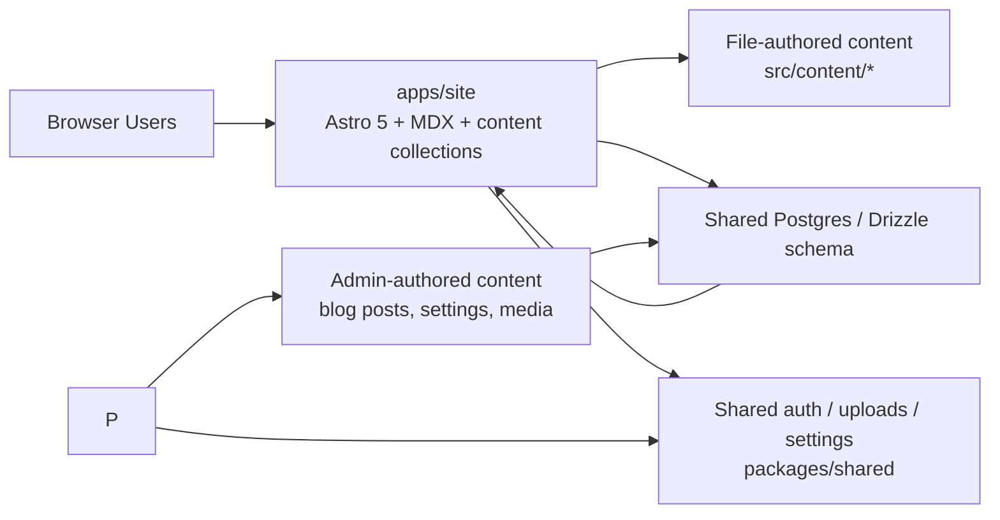

# steveackley.org Monorepo

`steveackley.org` is now split into a content-first Astro site and a separate Next.js portal for authenticated admin/client workflows.

## Canonical Stack Diagram



## Repo Layout

| Path | Responsibility |
|---|---|
| `apps/site` | Public website, resume, blog rendering, project pages, admin/client portal |
| `packages/shared` | Shared DB schema, Better Auth config, settings helpers, uploads, common types |
| `docs` | Architecture, data flow, security, route ownership, content model, ADRs |

## Stack

| Area | Technology |
|---|---|
| Site / Portal | Astro 5, React islands, MDX, Astro content collections |
| Shared backend | PostgreSQL 16, Drizzle ORM, Better Auth |
| Storage | Cloudflare R2 |
| Styling | CSS/Tailwind-compatible tokens and app-local styling |
| Language | TypeScript |

## Local Development

### Bootstrap

```bash
npm install
docker compose -f docker-compose.dev.yml up -d db
```

### Run app

```bash
npm run dev:site
```

Default local URL:

- Site: [http://localhost:3000](http://localhost:3000)

### Workspace scripts

```bash
npm run typecheck
npm run lint
npm run test
npm run build
```

Per-app:

```bash
npm run typecheck:site
npm run build:site
```

Targeted reproducibility checks:

```bash
npm run test:site:health
```


That path runs the public site health-route contract test only, which is useful
when validating deployment health behavior without pulling the broader site or
portal test surface into the loop.

## Environment Model

Shared environment values still live at the repo root today, but the runtime boundary is now per app.

| Variable | Used By | Purpose |
|---|---|---|
| `DATABASE_URL` | `apps/site`, `apps/portal`, `packages/shared` | Shared PostgreSQL connection |
| `BETTER_AUTH_SECRET` | `apps/portal`, shared auth handler | Session/auth secret |
| `BETTER_AUTH_URL` | `apps/portal`, shared auth handler | Better Auth base URL |
| `PORTAL_BASE_URL` | `apps/site` | Redirect target for `/admin/*` and `/client/*` |
| `R2_*` | `apps/portal`, shared upload helpers | Cloudflare R2 media storage |
| `GH_API_TOKEN` | `apps/site` | Public GitHub repo enrichment on homepage |

## Content Ownership

| Content Type | Source of Truth | Managed In |
|---|---|---|
| Resume timeline and skill data | Astro content collection | `apps/site/src/content/resume/*` |
| Homepage copy and public narrative content | Astro content collection | `apps/site/src/content/pages/*` |
| Public project writeups | Astro content collection / MDX | `apps/site/src/content/projects/*` |
| Blog posts | Database-backed authored content | `apps/site` admin workflows + shared DB |
| Site settings | Database-backed authored content | `apps/site` admin workflows + shared DB |

## Route Ownership

| Surface | Owner |
|---|---|
| `/`, `/blog/*`, `/resume`, public project pages | `apps/site` |
| `/admin/*` | `apps/site` |
| `/client/*` | `apps/site` |

The Astro site handles all routes, including authenticated admin/client portal surfaces.


## Documentation

| Doc | Focus |
|---|---|
| [docs/ARCHITECTURE.md](./docs/ARCHITECTURE.md) | Top-level architecture overview |
| [docs/STACK_ARCHITECTURE.md](./docs/STACK_ARCHITECTURE.md) | Stack breakdown by app/package |
| [docs/CONTENT_ARCHITECTURE.md](./docs/CONTENT_ARCHITECTURE.md) | Collections, MDX, and authored content boundaries |
| [docs/DATA_FLOW.md](./docs/DATA_FLOW.md) | Public render, portal authoring, auth, and upload flows |
| [docs/DEPLOYMENT_ARCHITECTURE.md](./docs/DEPLOYMENT_ARCHITECTURE.md) | Deployment, domains, and environment partitioning |
| [docs/SECURITY.md](./docs/SECURITY.md) | Security model across site, portal, shared services |
| [docs/ADR-001-astro-site-next-portal.md](./docs/ADR-001-astro-site-next-portal.md) | Decision log for the split architecture |
| [docs/ROUTES.md](./docs/ROUTES.md) | Route ownership and migration map |
| [docs/DATABASE.md](./docs/DATABASE.md) | Shared schema and persistence boundaries |
| [docs/ARCHITECTURE_ANALYSIS.md](./docs/ARCHITECTURE_ANALYSIS.md) | Documentation inventory and migration status |

## Status

The structural split is implemented:

- Astro app moved to `apps/site`
- Next portal scaffolded under `apps/portal`
- shared auth/DB/settings/uploads moved into `packages/shared`
- public resume and homepage copy migrated into Astro collections
- docs rewritten around the split stack

The split architecture is in place, but the portal is still being brought up to feature parity. The current release path remains the single-container Astro deployment until `apps/portal` is provisioned as its own production host.
