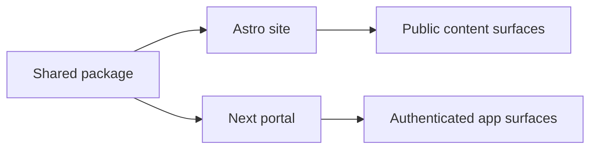

# ADR-001: Keep Astro For Public Site, Move Portal To Next.js

## Status

Accepted — **not implemented** (as of 2026-06-01). See [Current State](#current-state-2026-06-01) below.

## Context

The repo began as an Astro site but accumulated admin, client, upload, and authenticated dashboard behavior. That pushed Astro into app-framework territory and increased friction at the `.astro` / React boundary.

## Decision

- Keep Astro as the public site framework.
- Move authenticated admin/client surfaces into a separate Next.js App Router app.
- Centralize shared backend concerns in `packages/shared`.

## Consequences

### Positive

- Public site stays fast and content-first.
- Portal gains a framework aligned with auth-heavy, stateful workflows.
- Documentation and ownership boundaries become clearer.

### Negative

- Two frontend apps must be maintained.
- Shared package discipline becomes more important.
- Full feature parity migration requires additional follow-up work.

## Diagram (target state — not implemented)

## Current State (2026-06-01)

The split was never executed. Admin and client routes still live inside `apps/site` (`pages/admin/*`, `pages/client/*`), and the auth handler is at `apps/site/src/pages/api/auth/[...all].ts`. There is no `apps/portal` directory.

Why it didn't ship:
- The single-app structure has proven sufficient. The pain points that motivated the split (Astro-as-app-framework friction, mixed concerns) were partially resolved by extracting backend primitives into `packages/shared` and by improving the `client:load` SSR story.
- Operational simplicity matters: one container, one deploy, one DB connection pool is easier than two.

Going forward, treat the docs as describing the actual implementation (single `apps/site`). If the portal split becomes valuable again — for example, if auth-heavy workflows grow large enough to benefit from React Server Components — write a follow-up ADR superseding this one rather than reviving this plan as-is.
