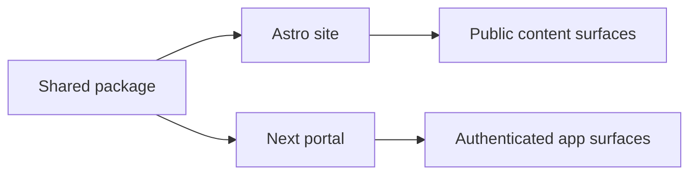

# ADR-001: Keep Astro For Public Site, Move Portal To Next.js

## Status

Accepted

## Context

The repo began as an Astro site but accumulated admin, client, upload, and authenticated dashboard behavior. That pushed Astro into app-framework territory and increased friction at the `.astro` / React boundary.

## Decision

- Keep Astro as the public site framework.
- Move authenticated admin/client surfaces into a separate Next.js App Router app.
- Centralize shared backend concerns in `packages/shared`.

## Consequences

### Positive

- Public site stays fast and content-first.
- Portal gains a framework aligned with auth-heavy, stateful workflows.
- Documentation and ownership boundaries become clearer.

### Negative

- Two frontend apps must be maintained.
- Shared package discipline becomes more important.
- Full feature parity migration requires additional follow-up work.

## Diagram

