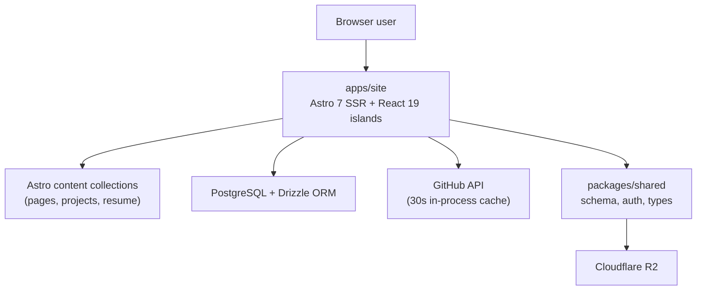

# Architecture Overview

## System Shape

Single deployable app. The repo is a `npm` workspaces monorepo with one runtime application (`apps/site`) and one shared library (`packages/shared`).

## Responsibilities

| Layer | Responsibilities |
|---|---|
| `apps/site` | Public rendering, blog (DB-backed), admin and client portals, all `/api/*` routes, auth callbacks |
| `packages/shared` | Drizzle schema, Better Auth configuration, DB client, common types |

## Route Ownership Inside `apps/site`

| Path | Purpose |
|---|---|
| `/`, `/blog/*`, `/resume` | Public site |
| `/admin/*` | Admin portal (Better Auth, role=`admin`) |
| `/client/*` | Client portal (role=`client`) |
| `/api/auth/[...all]` | Better Auth handler |
| `/api/github/repos` | 30s-cached enriched repo list (shared with SSR) |
| `/api/cron/*` | Scheduled jobs |

## Dashboard (home page) Architecture

The home page is server-rendered (`client:load`, not `client:only`), so the React `TabsDashboard` island produces real HTML on first response — H1, hero text, project list — and hydrates after JS loads.

- **SSR data fan-out:** `pages/index.astro` fans blog posts, GitHub repos, home content, and featured projects through a single `Promise.all` (was a serial `await` chain).
- **Live repo refresh:** The React island polls `/api/github/repos` every 30s. The endpoint shares a module-level cache in `lib/github.ts` with the SSR call — one GH round-trip per cache window regardless of visitors.
- **Sort:** Repos are sorted strictly by `pushed_at desc` (last commit). No manual pinning.
- **A11y:** Tab bar implements the W3C ARIA tabs pattern — `role="tablist"` + `role="tab"` + `aria-selected` + roving `tabindex` + ArrowLeft/ArrowRight/Home/End handlers.

## Boundary Rules

- Shared package (`packages/shared`) exposes types, DB client, auth config — no UI, no framework-specific code.
- Astro pages are SSR-rendered (`output: 'server'`) and may freely query the DB through Drizzle.
- React islands are used for behavior that requires client state (tabs, polling, forms); use `client:load` (SSR + hydrate) when initial markup matters for LCP/SEO, `client:only` only for genuinely browser-only widgets.

## Historical Note

ADR-001 proposed splitting the authenticated surfaces into a separate Next.js `apps/portal` app. That decision was accepted but never implemented — the admin and client routes still live inside `apps/site`. See [ADR-001](./ADR-001-astro-site-next-portal.md) for context and current status.
