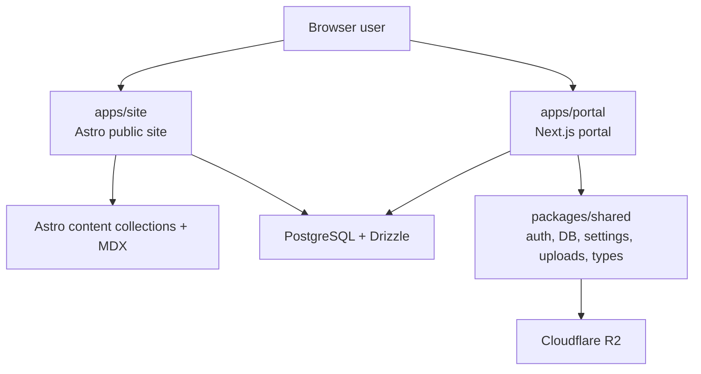

# Architecture Overview

## System Shape

## Responsibilities

| Layer | Responsibilities |
|---|---|
| `apps/site` | Public rendering, content collections, MDX pages, public blog/resume/project presentation |
| `apps/portal` | Admin/client route ownership, authenticated application surfaces, future app workflows |
| `packages/shared` | Shared schema, Better Auth configuration, uploads, settings, common DTOs |

## Boundary Rules

- Astro is content-first and should avoid owning operational workflows.
- Next.js owns `/admin/*` and `/client/*`.
- Shared packages may expose types, config, DB/auth helpers, and framework-agnostic utilities.
- UI components are not shared across Astro and Next by default.

## Current Migration Note

The structural split is in place, and the public site now redirects authenticated routes to the portal base URL. Some interactive admin/client behaviors still need full parity work inside the Next app.
