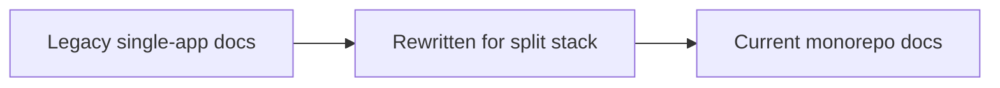

# Documentation Inventory And Migration Status

## Classification

| Document | Status | Notes |
|---|---|---|
| `README.md` | Revised | Canonical stack diagram and monorepo commands |
| `docs/ARCHITECTURE.md` | New | Top-level architecture overview |
| `docs/STACK_ARCHITECTURE.md` | New | Clear stack boundary by app/package |
| `docs/CONTENT_ARCHITECTURE.md` | New | Collection and authored-content model |
| `docs/DEPLOYMENT_ARCHITECTURE.md` | New | Domains, deployment targets, env partitioning |
| `docs/DATA_FLOW.md` | Revised | Split public render, portal authoring, auth, uploads |
| `docs/DATABASE.md` | Revised | Shared schema ownership and persistence model |
| `docs/ROUTES.md` | Revised | Route ownership map and migration notes |
| `docs/SECURITY.md` | Revised | Security model across site, portal, shared services |
| `docs/PRD.md` | Revised | Product boundary between public site and portal |
| `docs/SDD.md` | Revised | Implementation-oriented software design overview |

## Remaining Documentation Work

- Expand portal docs as interactive feature parity is ported from legacy Astro routes.
- Update deployment runbooks when the portal deployment target is finalized.
