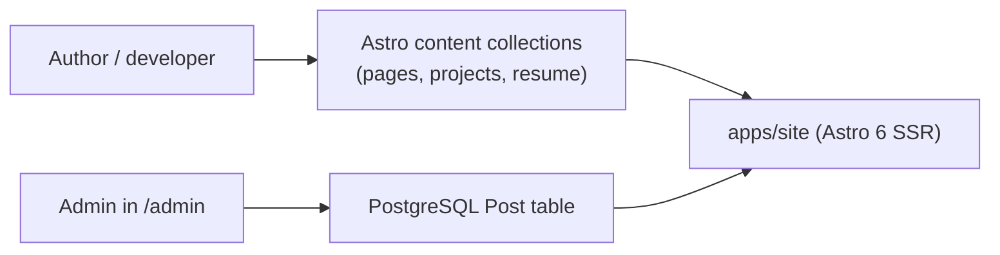

# Content Architecture

## Content Model

Two coexisting sources of truth. File-authored content powers everything that rarely changes (home page hero, project list, resume). DB-backed content powers the blog, where posts are authored in the admin UI and read by public pages.

## File-Authored Content

| Collection | Purpose | Path |
|---|---|---|
| `pages` | Homepage hero, about, opportunities, contact info | `apps/site/src/content/pages/*` |
| `projects` | Project case-study content (featured + archive) | `apps/site/src/content/projects/*` |
| `resume` | Summary, experience, education, certifications, skills | `apps/site/src/content/resume/*` |

These are the only content collections registered. There is **no `blog` content collection** — the directory `apps/site/src/content/blog/` is empty and unregistered. Earlier MDX files there were never wired into Astro and were removed.

## DB-Authored Content

| Content | Source of truth | Authored from |
|---|---|---|
| Blog posts | PostgreSQL `Post` table | `/admin/posts/*` (TipTap rich-text editor) |
| Site settings | PostgreSQL `SiteSetting` table | `/admin/settings` |
| Uploaded media | Cloudflare R2 + DB references | `/admin/posts/*` (TipTap image upload) |

Blog read path: `pages/blog/index.astro` and `pages/blog/[slug].astro` both query the `Post` table via Drizzle. The rendered `content` column is raw HTML (TipTap output) injected via `set:html`.

## Rules

- Use Astro content collections for content that ships with the codebase.
- Use the DB for content edited in production through the admin UI.
- Do not place files in `apps/site/src/content/blog/` — there is no collection for them.
- If a piece of content needs to be both file-authored and editable in admin, pick one source of truth — don't sync.
