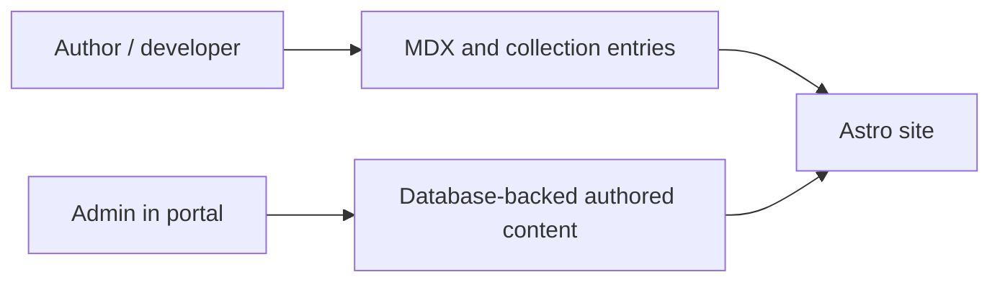

# Content Architecture

## Content Model

## File-Authored Content

| Collection | Purpose | Path |
|---|---|---|
| `pages` | Homepage and public narrative content | `apps/site/src/content/pages/*` |
| `projects` | Public project and case-study content | `apps/site/src/content/projects/*` |
| `resume` | Resume summary, experience, education, certifications, skills | `apps/site/src/content/resume/*` |
| `blog` | Future file-authored long-form posts | `apps/site/src/content/blog/*` |

## Admin-Authored Content

| Content | Source of truth | Managed from |
|---|---|---|
| Blog posts | PostgreSQL | `apps/portal` |
| Site settings | PostgreSQL | `apps/portal` |
| Uploaded media | Cloudflare R2 + DB references | `apps/portal` |

## Rules

- Use MDX for narrative content and project writeups.
- Use structured collection frontmatter for resume and homepage data.
- Keep public copy out of TSX literals where Astro collections can own it.
- Keep operational content in DB-backed workflows when it must be edited in-app.
