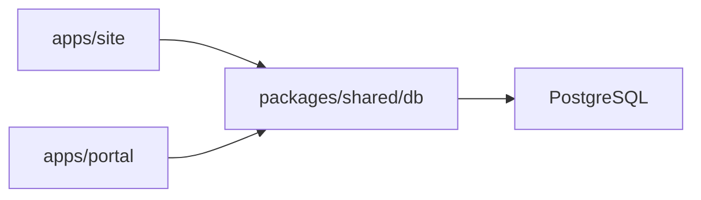

# Database

## Shared Persistence Diagram

## Ownership

The schema is shared, but application ownership is not:

| Table/Area | Primary owner |
|---|---|
| `Post`, `SiteSetting`, `Message`, `User`, `ClientApp` | Portal workflows |
| Public reads against `Post` and `SiteSetting` | Site |
| Better Auth session/account tables | Portal auth, shared config |

## Design Rule

- Schema and DB connection live in `packages/shared`.
- Frontend apps consume shared DB access, not their own duplicated schema definitions.
- Public Astro pages should remain read-oriented even when they query the shared database.
