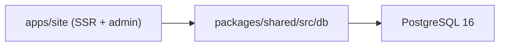

# Database

## Connection

Single application connects to a single PostgreSQL instance. The Drizzle client lives in `packages/shared/src/db/index.ts`; both public SSR pages and admin server actions consume the same exported `db` instance.

## Tables

All tables use PascalCase names (legacy from a prior Prisma generation; mapped via `pgTable("Name", …)` in `packages/shared/src/db/schema.ts`).

| Table | Purpose | Primary writer |
|---|---|---|
| `Post` | Blog posts (TipTap HTML in `content`, slug-unique) | `/admin/posts/*` |
| `SiteSetting` | Key/value config edited in the admin | `/admin/settings` |
| `Message` | Internal messaging between users | `/admin`, `/client` |
| `User` | All accounts (role: `admin` or `client`) | `/admin/users`, signup flow |
| `Session`, `Account`, `Verification` | Better Auth-managed auth tables | Better Auth handler |
| `ClientApp`, `UserApp` | Per-client app registrations | `/admin/apps` |
| `PasswordResetToken` | Password reset flow | Auth flow |

## Migrations

- Drizzle Kit is used for schema diffing and migration generation.
- Migrations apply at container startup via `docker/entrypoint.sh` → `npx drizzle-kit push --force` (or equivalent), against the `db` service in the same Docker network.
- The legacy `drizzle.__drizzle_migrations` ledger may be empty in older databases where tables were originally created by Prisma; new schema changes flow through Drizzle going forward.

## Design Rules

- Schema and DB connection live in `packages/shared`. Frontend pages and API routes consume the shared `db` instance — never duplicate schema definitions.
- Public Astro pages may freely read but should not write — admin and API routes own all mutations.
- Narrow `.select({...})` calls on public pages to avoid pulling large columns (like `Post.content`) into React island props.
