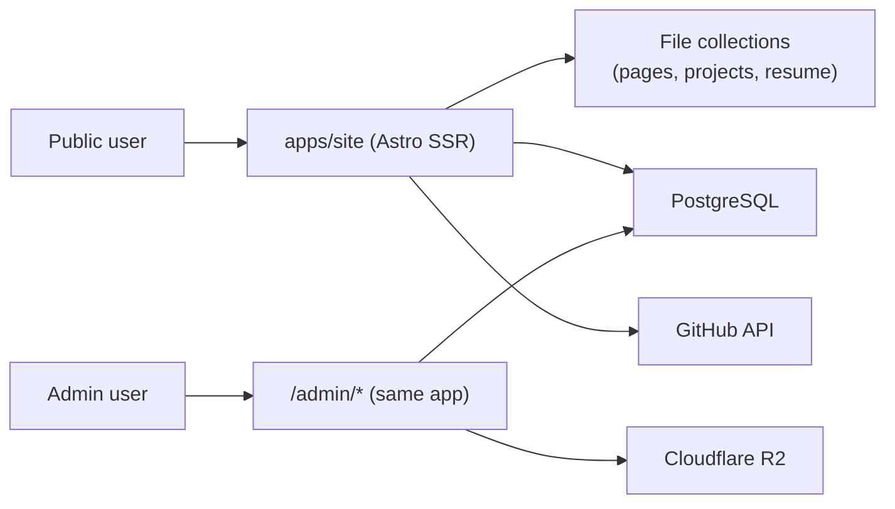

# Data Flow

## Diagram



One app, two audiences. Public requests are read-only; admin requests write to Postgres and R2.

## Public Render Flow (home page)

1. Request hits `apps/site` at `/`.
2. `pages/index.astro` fans out four reads in parallel via `Promise.all`:
   - Blog posts — narrowed Drizzle `select` (id, title, slug, excerpt, createdAt) so the full HTML `content` blob doesn't leak into island props.
   - GitHub repos via `getCachedRepos()` — 30s in-process cache + in-flight de-dupe.
   - Home content — Astro `pages` collection.
   - Featured projects — Astro `projects` collection.
3. Astro renders the `TabsDashboard` React island with `client:load` — full SSR markup ships immediately; hydration replaces it.
4. On mount, the React island polls `/api/github/repos` every 30s and ticks relative timestamps every 5s — both stay client-only via `useEffect`.

## Public Render Flow (blog)

1. `pages/blog/index.astro` (or `[slug].astro`) queries the `Post` table via Drizzle.
2. Posts with `published = true` are returned in `createdAt desc` order.
3. The `content` column (raw TipTap HTML) is injected via `set:html` inside `PostContent.astro`.

## Admin Authoring Flow

1. Admin signs in via `/login` → Better Auth handler at `pages/api/auth/[...all].ts`.
2. `/admin/posts/new` and `/admin/posts/[id]/edit` use TipTap to produce HTML, then call Astro server actions (Zod-validated, admin-gated) that write to `Post`.
3. Media uploads route through a shared R2 upload helper before the post body is saved.

## Auth Flow

- Better Auth config lives in `packages/shared/lib/auth`; the Astro handler re-exports it from `apps/site/src/lib/auth.ts`.
- Sessions are DB-persisted (`Session`, `Account`, `User` tables).
- Role check (`admin` vs `client`) gates admin routes via middleware.

## GitHub Cache Flow

```
SSR request ──┐
              ├──▶ getCachedRepos() ──▶ cache fresh? ── return ─┐
Polling req ──┘                              │                  │
                                             ├── stale ─▶ fetch + enrich + cache ─┐
                                             └── inflight Promise ── await ───────┘
```

Both SSR and the `/api/github/repos` endpoint go through `getCachedRepos()` in `lib/github.ts`. One GitHub round-trip per 30s window regardless of concurrent visitors.
