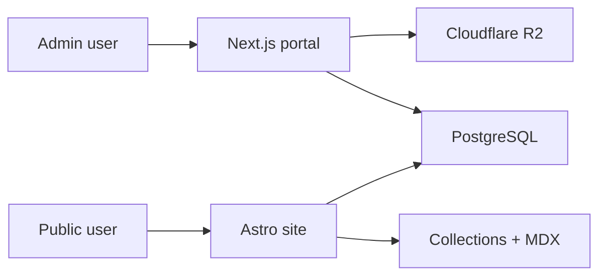

# Data Flow

## Diagram

## Public Render Flow

1. Public request hits `apps/site`.
2. Astro reads file-authored content from collections and public DB-backed content from PostgreSQL.
3. Astro renders the response with minimal client hydration.

## Portal Authoring Flow

1. Admin/client request hits `apps/portal`.
2. Next route handlers, server components, and future server actions use `packages/shared`.
3. Writes land in PostgreSQL or Cloudflare R2.
4. Public site reflects DB-backed changes on subsequent renders.

## Auth Flow

1. Portal auth requests go through `apps/portal/src/app/api/auth/[...all]/route.ts`.
2. Shared Better Auth config in `packages/shared` owns auth setup.
3. Astro no longer owns authenticated route handling; it redirects `/admin/*` and `/client/*` to `PORTAL_BASE_URL`.

## Upload Flow

1. Portal upload UI submits media.
2. Shared upload helper validates and writes to R2.
3. Resulting public URL is stored in DB-backed content/settings as needed.
