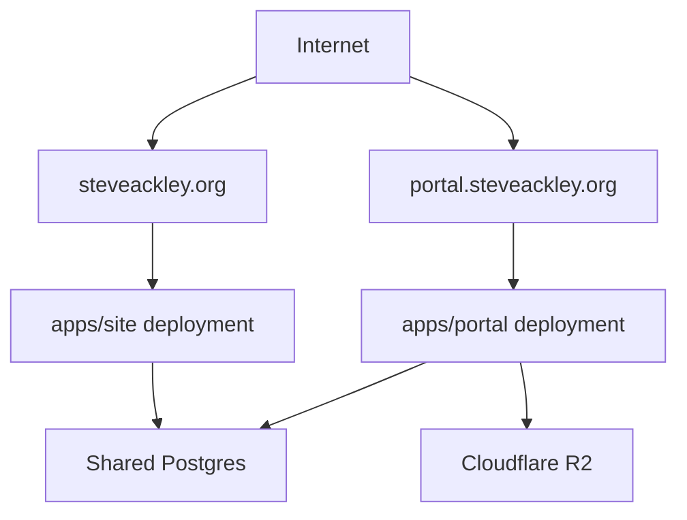

# Deployment Architecture

## Deployment Diagram

## Domain Model

| Domain | App | Purpose |
|---|---|---|
| `steveackley.org` | `apps/site` | Public website |
| `portal.steveackley.org` | `apps/portal` | Admin and client portal |

## Environment Partitioning

| Variable set | Site | Portal |
|---|---|---|
| Public rendering data (`DATABASE_URL`, `GH_API_TOKEN`) | Yes | Optional |
| Auth secrets (`BETTER_AUTH_SECRET`, `BETTER_AUTH_URL`) | Redirect-only awareness | Yes |
| Upload/storage (`R2_*`) | No | Yes |
| Route split (`PORTAL_BASE_URL`) | Yes | No |

## Operational Notes

- The Astro site should not be deployed as the authenticated portal host.
- The portal deployment should own auth callbacks and interactive admin/client features.
- Shared infrastructure should be versioned and documented independently of either frontend.
