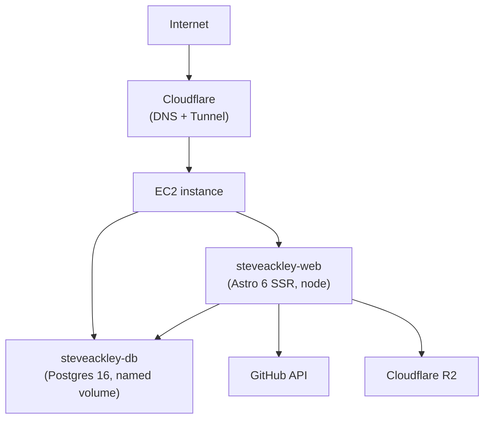

# Deployment Architecture

## Diagram



Single Docker Compose stack on one EC2 instance, fronted by a Cloudflare Tunnel (no inbound web ports — port 22 only).

## Domain

| Domain | Target |
|---|---|
| `steveackley.org` | The single deployed app (`steveackley-web` container) |

## Image Pipeline

```
git push main ──▶ CI (gh-actions ci-astro@v1) ──▶ build & push GHCR ──▶ SSH deploy
                  unit + integration + e2e         tags: latest + sha-<SHA>
```

- CI lives at `.github/workflows/deploy.yml`. Unit/integration/E2E delegated to the reusable `stevenfackley/gh-actions/.github/workflows/ci-astro.yml@v1`.
- Build job pushes `ghcr.io/stevenfackley/steveackley-web:latest` plus an immutable `sha-<SHA>` tag.
- Deploy job SSHes to EC2, writes `.env` from GitHub secrets, runs `docker compose pull web && docker compose up -d --remove-orphans`, and polls `http://localhost:3000/` until 200.

## Dockerfile

- Multi-stage `node:26-alpine` build + runner.
- **Builder uses `npm ci`** (lockfile-strict) — critical for reproducibility. The earlier `npm install --no-package-lock` allowed npm to drift dep resolution between local builds and CI, which silently flipped the JSX transform from automatic to classic and broke React island hydration in prod. Never re-introduce `--no-package-lock` in the Docker build.
- Runner copies only `dist/`, `node_modules/`, `package.json`, Drizzle config/migrations, and the entrypoint/seed scripts.

## Env Vars

| Variable | Used by | Source |
|---|---|---|
| `DATABASE_URL` | SSR pages, Drizzle migrations, Better Auth | GitHub Secret → `.env` |
| `BETTER_AUTH_SECRET`, `AUTH_SECRET` | Better Auth | GitHub Secret |
| `BETTER_AUTH_URL` | Auth redirect base | Hardcoded to `https://steveackley.org` in deploy.yml |
| `ADMIN_EMAIL`, `ADMIN_PASSWORD_HASH` | Seed admin on startup | GitHub Secret |
| `GH_API_TOKEN` | GitHub repo enrichment in `lib/github.ts` | GitHub Secret |
| `R2_*` (5 vars) | Media upload helper | GitHub Secret |
| `CLOUDFLARE_TUNNEL_TOKEN` | Cloudflare Tunnel sidecar container | GitHub Secret |

## Data Persistence

- Postgres data lives in the named Docker volume `postgres_data`. Survives container recreate.
- Uploads bind-mount `./uploads:/app/uploads` (legacy; R2 is the long-term store).

## Cloudflare Tunnel

A `cloudflared` sidecar container holds an outbound tunnel from EC2 to Cloudflare's edge. All HTTPS traffic enters via the tunnel; there is no inbound `:80` or `:443` open on the EC2 security group. See [deployment/CLOUDFLARE_TUNNEL_SETUP.md](./deployment/CLOUDFLARE_TUNNEL_SETUP.md) for setup detail.

## Why Single Container

A personal site + blog + admin doesn't justify a Kubernetes cluster. One EC2 instance with Docker Compose covers prod, with named-volume data persistence and immutable image tags providing roughly the same operational story for far less ongoing complexity.
