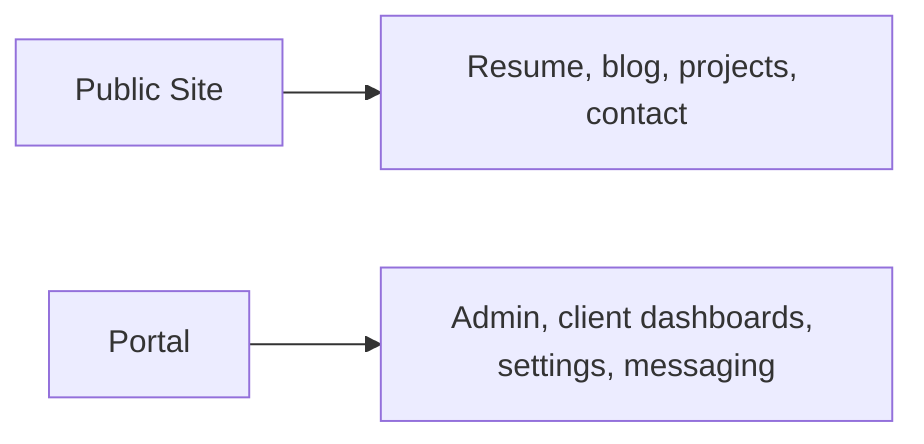

# Product Requirements Snapshot

## Product Split

## Public Site Goals

- Fast public rendering
- Clear professional presentation
- Maintainable content authoring through collections/MDX
- Strong Core Web Vitals

## Portal Goals

- Dedicated home for authenticated workflows
- Sustainable route ownership for admin and client surfaces
- Clear path for future expansion without turning Astro into an app framework

## Non-Goals

- Sharing framework-specific UI components between Astro and Next
- Rebuilding the public content system around in-app editing where file-authored content is simpler
