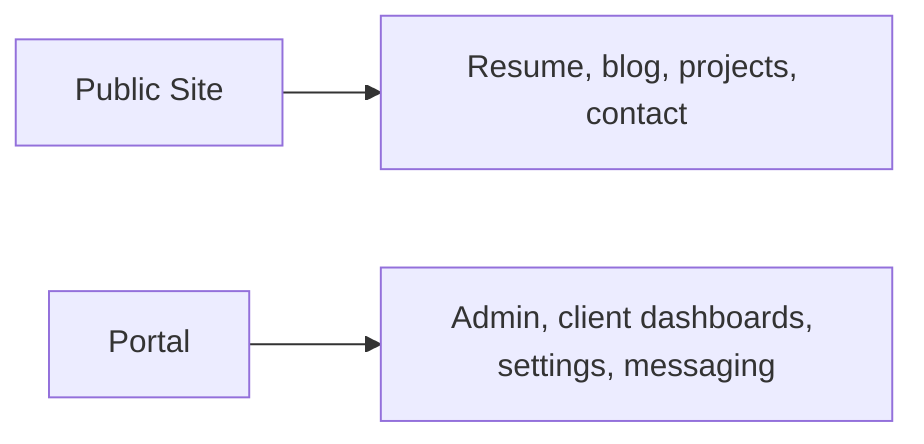

# Product Requirements Snapshot

> **Correction (2026-07-05):** Per [ADR-001](ADR-001-astro-site-next-portal.md), the Astro/Next split described below was accepted but never executed and is now frozen. The current architecture is a single Astro `apps/site` — "Portal" below refers to `admin/*` and `client/*` route groups within that app, not a separate Next.js app. Treat the goals as still-valid product intent, not a description of two codebases.

## Product Split

## Public Site Goals

- Fast public rendering
- Clear professional presentation
- Maintainable content authoring through collections/MDX
- Strong Core Web Vitals

## Portal Goals

- Dedicated home for authenticated workflows
- Sustainable route ownership for admin and client surfaces
- Clear path for future expansion without turning Astro into an app framework

## Non-Goals

- Sharing framework-specific UI components between Astro and Next
- Rebuilding the public content system around in-app editing where file-authored content is simpler
