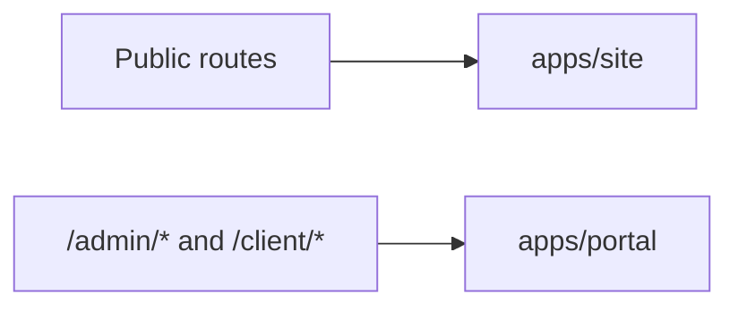

# Route Ownership

## Diagram

## Route Map

| Route family | Owner | Notes |
|---|---|---|
| `/` | Site | Homepage and public dashboard |
| `/blog/*` | Site | Public blog rendering |
| `/resume` | Site | Collection-backed resume |
| `/admin/*` | Portal | Redirected away from Astro |
| `/client/*` | Portal | Redirected away from Astro |
| `/api/auth/*` | Portal | Auth callback/handler entry |

## Migration Note

Legacy Astro admin/client pages still exist in the repo for reference, but runtime ownership now belongs to the portal via site-level redirect.
