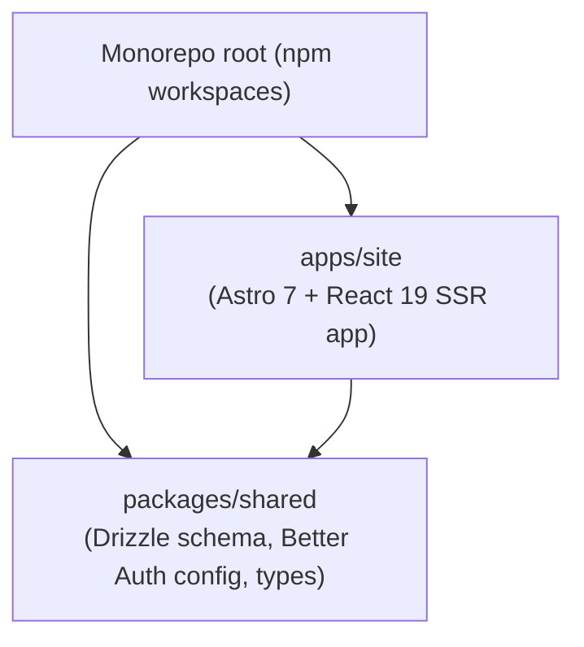

# Software Design Document

## High-Level Design

One runtime application, one shared library. All public, admin, client, and API routes live inside `apps/site`.

## Design Principles

- **Astro SSR for everything.** No client-side routing layer; each page is a server-rendered Astro file. React islands handle interactive components (tabs, editors, forms).
- **`client:load` over `client:only`** when the island's initial markup matters for SEO/LCP/a11y. Use `client:only` only for genuinely browser-only behavior.
- **Shared package owns backend primitives.** Schema, Drizzle client, Better Auth config, and common types live in `packages/shared`. No UI lives there.
- **Public pages read; admin pages write.** SSR-rendered public pages should be read-only; mutations flow through admin/client routes or API endpoints.
- **One source of truth per content type.** File-collection or DB — not both. Do not sync.

## Current Implementation State

- Single `apps/site` deployable; one Docker image (`ghcr.io/stevenfackley/steveackley-web`).
- Auth via Better Auth (DB-persisted sessions), handler at `pages/api/auth/[...all].ts`.
- Blog is exclusively DB-backed (`Post` table, TipTap HTML); MDX files in `src/content/blog/` are not registered as a collection and were removed.
- Home dashboard SSRs the `TabsDashboard` React island via `client:load`; the same island polls `/api/github/repos` every 30s for live updates.
- GitHub repo enrichment uses a shared 30s module-level cache in `lib/github.ts` consumed by both SSR and the API endpoint.
- ARIA tabs pattern implemented in `TabsDashboard` (role, roving tabindex, keyboard nav).

## Out-of-Scope (Was Planned, Not Built)

ADR-001 accepted a decision to split the authenticated surfaces into a separate `apps/portal` Next.js app. That split was never executed. The codebase continues to treat `apps/site` as the single home for everything. See [ADR-001](./ADR-001-astro-site-next-portal.md).

## Conventions

- Conventional Commits (`feat:`, `fix:`, `chore:`, etc.).
- Feature-branch PRs only; never push directly to `main`.
- Workspace-aware npm scripts (`npm run dev:site`, `npm run build:site`).
- Astro check + vitest unit + integration + Playwright E2E gates every PR (via the `stevenfackley/gh-actions/.github/workflows/ci-astro.yml@v1` reusable workflow).
