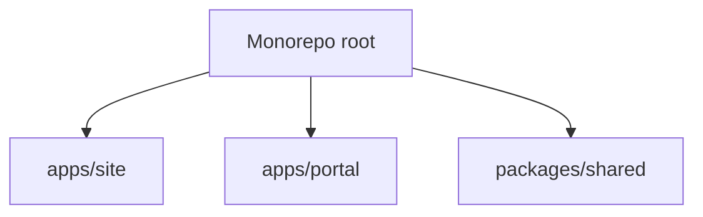

# Software Design Document

## High-Level Design

## Design Principles

- Keep public rendering and app workflows in separate frontend apps.
- Move public copy and structured public data into Astro collections.
- Keep cross-app reuse limited to types, schema, auth, settings, and upload helpers.
- Let route ownership drive framework choice instead of forcing one app to own everything.

## Current Implementation State

- Workspace manifests are in place.
- Shared package owns DB/auth/settings/uploads/types.
- Site uses collection-backed homepage and resume data.
- Portal owns the new route map and shared data access scaffold.

## Follow-Up Engineering Work

- Port legacy Astro admin/client forms into Next server actions and React UI.
- Remove deprecated Astro admin/client pages after feature parity is complete.
- Add app-level CI and deployment workflows for each frontend app.
