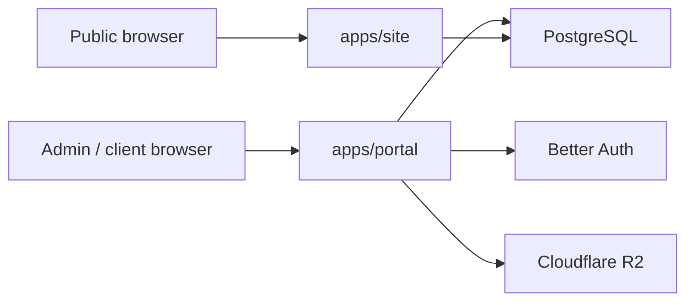

# Security

## Security Boundary Diagram

## Model

- Public site is read-oriented and should expose as little privileged behavior as possible.
- Portal owns authenticated routes and should own auth/session enforcement.
- Shared secrets are consumed only by the apps that need them.

## Controls

| Area | Control |
|---|---|
| Auth | Better Auth through the portal app |
| Uploads | Shared R2 helper with MIME and size validation |
| DB access | Drizzle ORM, shared schema, parameterized queries |
| Route ownership | Astro redirects authenticated route families to the portal |
| Secrets | Per-app env partitioning with shared values only where necessary |

## Near-Term Follow-Up

- Move all interactive admin/client mutations fully into portal route handlers or server actions.
- Add portal middleware/session enforcement when the interactive auth UI is completed.
- Remove deprecated Astro auth-only runtime code once the old pages are retired.
