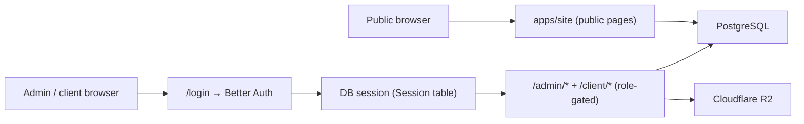

# Security

## Boundaries

Single deployable. Authentication is enforced at the route level inside `apps/site` — there is no separate trust boundary between "site" and "portal".

## Model

- Public pages are read-oriented; SSR queries against the DB are filtered to public/published rows only.
- `/admin/*` requires `role = 'admin'`; `/client/*` requires `role = 'client'`. Enforcement lives in page-level checks and Astro server actions (Zod-validated).
- Auth secrets, GH API token, and R2 credentials are written from GitHub Actions secrets into the EC2 `.env` file (chmod 600) at deploy time. Never committed.
- Cloudflare Tunnel is the only ingress path — port 22 is the only inbound port on the EC2 security group.

## Controls

| Area | Control |
|---|---|
| Auth | Better Auth, DB-persisted sessions, role enum (`admin` / `client`) |
| Admin mutations | Astro server actions with Zod validation, role check on every action |
| Uploads | Shared R2 helper validates MIME + size; signed URLs returned for read |
| DB access | Drizzle ORM, parameterized queries, narrow `select` lists on public reads |
| CSP | `Content-Security-Policy` set in `astro.config.mjs` (covers script-src, style-src, img-src, connect-src, font-src) |
| Secrets | GitHub Actions secrets → `.env` (chmod 600) at deploy; never in repo |

## Automated Security Tooling

| Tool | Mode | Languages / Scope |
|---|---|---|
| GitHub CodeQL | default-setup (managed) | `actions`, `javascript`, `javascript-typescript`, `typescript` — auto-detected |
| Dependabot | `.github/dependabot.yml` | npm dependency updates and security advisories |
| Copilot Autofix | enabled on CodeQL findings | Posts suggested patch commits to `refs/pull/N/head` — reconcile before pushing follow-on commits |

Workflow `permissions:` are constrained at the top of `.github/workflows/deploy.yml` (default `contents: read`); the `build-and-push` job declares its own `packages: write` for GHCR.

## Sweep History

| Date | PR | Closed | Notes |
|---|---|---|---|
| 2026-05-06 | [#79](https://github.com/stevenfackley/steveackley-website/pull/79) | 14 CodeQL + 2 Dependabot | XSS-through-DOM, double-escape, workflow perms, log-forging, `yaml`/`ip-address` transitives |
| 2026-05-31 | [#107](https://github.com/stevenfackley/steveackley-website/pull/107) | 3 Dependabot | Reconcile vite/esbuild majors, force-patch dead `@esbuild-kit/core-utils`, kill esbuild dev-server CORS advisory |

## Known Trade-offs

- Blog `content` is raw HTML (TipTap output) rendered with `set:html`. Trust depends on the TipTap editor's output being clean — admin is a trusted writer surface, so this is acceptable. Never accept arbitrary HTML from non-admin users.
- Public site reads run against the live prod DB on every request. Acceptable for current traffic; revisit if traffic justifies a read replica or edge cache.
