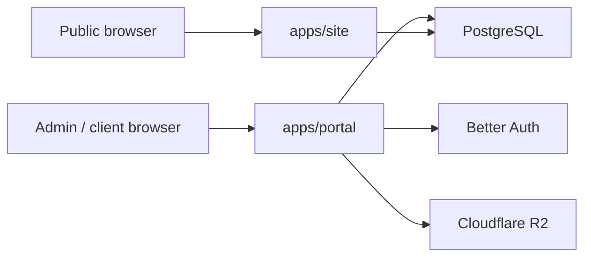

# Security

## Security Boundary Diagram

## Model

- Public site is read-oriented and should expose as little privileged behavior as possible.
- Portal owns authenticated routes and should own auth/session enforcement.
- Shared secrets are consumed only by the apps that need them.

## Controls

| Area | Control |
|---|---|
| Auth | Better Auth through the portal app |
| Uploads | Shared R2 helper with MIME and size validation |
| DB access | Drizzle ORM, shared schema, parameterized queries |
| Route ownership | Astro redirects authenticated route families to the portal |
| Secrets | Per-app env partitioning with shared values only where necessary |

## Automated Security Tooling

| Tool | Mode | Languages / Scope |
|---|---|---|
| GitHub CodeQL | default-setup (managed) | `actions`, `javascript`, `javascript-typescript`, `typescript`. Languages auto-detected; the matrix updates automatically when source for a language is added or removed. |
| Dependabot | `.github/dependabot.yml` | npm dependency updates and security advisories. |
| Copilot Autofix | enabled on CodeQL findings | Posts suggested patch commits to `refs/pull/N/head` — reconcile before pushing follow-on commits to the PR branch. |

Workflow `permissions:` are constrained at the top of `.github/workflows/deploy.yml` (default `contents: read`); the `build-and-push` job declares its own `packages: write` override for GHCR.

### Sweep history

| Date | PR | Closed | Notes |
|---|---|---|---|
| 2026-05-06 | [#79](https://github.com/stevenfackley/steveackley-website/pull/79) | 14 CodeQL + 2 Dependabot | XSS-through-DOM, double-escape, workflow perms, log-forging (deletion of orphan PaaS tree), `yaml`/`ip-address` transitives. |

## Near-Term Follow-Up

- Move all interactive admin/client mutations fully into portal route handlers or server actions.
- Add portal middleware/session enforcement when the interactive auth UI is completed.
- Remove deprecated Astro auth-only runtime code once the old pages are retired.
