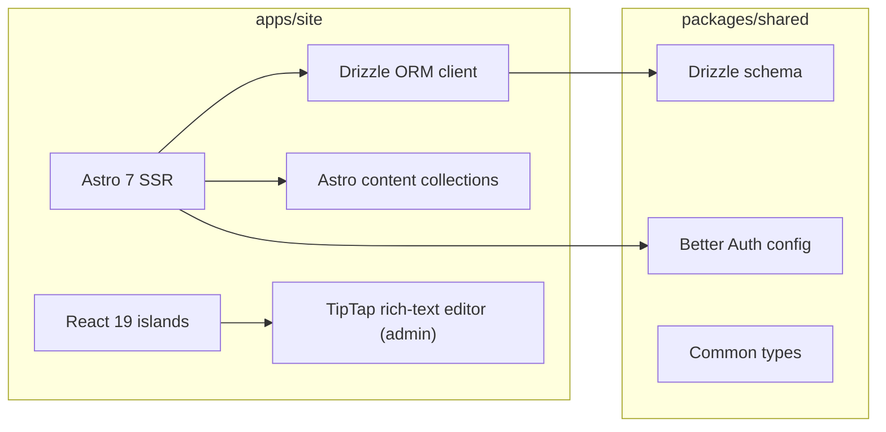

# Stack Architecture

## Diagram

One application stack. The shared package supplies schema, auth config, and types — nothing more.

## Versions

| Layer | Tech | Version |
|---|---|---|
| Public site framework | Astro | 7.x |
| React islands | React + React DOM | 19.2.x |
| Auth | Better Auth (DB-persisted sessions) | latest |
| Database | PostgreSQL | 16-alpine |
| ORM | Drizzle ORM + drizzle-kit | latest |
| Rich text editor | TipTap | 3.x |
| CSS | TailwindCSS | 4.x (CSS-first config) |
| Object storage | Cloudflare R2 (S3-compatible) | — |
| Node runtime | Node | 26-alpine |
| Build pipeline | Vite | 8.x (pinned via overrides) |
| Container runtime | Docker + Docker Compose | — |
| Reverse tunnel | Cloudflared | latest |

## JSX Transform

JSX is pinned to the **automatic** transform via `vite.esbuild.jsx = 'automatic'` in `astro.config.mjs`. This is a defensive belt-and-suspenders pin: without it, dep-resolution drift can flip esbuild to the default `'transform'` (classic) runtime, which emits `React.createElement` without auto-importing React and breaks `client:load` / `client:only` islands at hydration time.

The Dockerfile uses `npm ci` (lockfile-strict) so the prod container's dep tree matches local + CI tests exactly.

## Caching

- **GitHub repos:** 30s module-level in-memory cache + in-flight de-dupe in `lib/github.ts`. Used by SSR `pages/index.astro` and by the `/api/github/repos` polling endpoint.
- **HTTP:** The HTML page response is `cf-cache-status: DYNAMIC` (correct — content includes live blog posts and live repos). Static assets under `/_astro/` ship with `Cache-Control: public, max-age=31536000, immutable` and are content-hashed by Astro.

## Why This Stack

- **Astro 7 SSR** suits the workload — mostly-static public content, a handful of interactive React islands, full DB query access at request time.
- **React 19 islands** confine framework cost to the components that need state (dashboard tabs, TipTap editor, admin forms).
- **Drizzle** gives full TypeScript types over Postgres without a runtime ORM tax.
- **TipTap + raw HTML in DB** keeps the read path simple — no markdown-to-HTML conversion on each render.
- **Better Auth** for DB-persisted sessions; no third-party auth provider lock-in.
