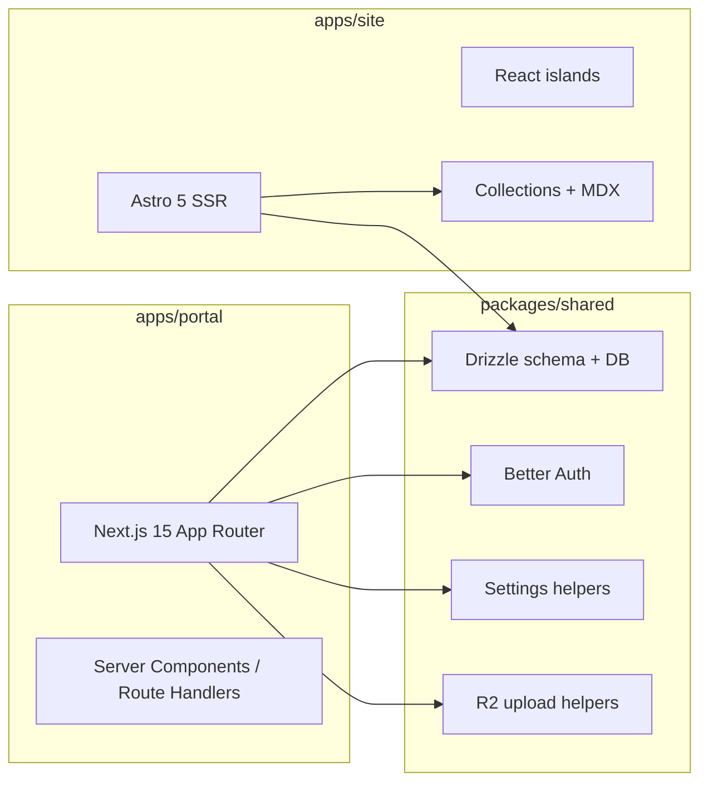

# Stack Architecture

## Diagram

## App Stack

| App | Primary stack | Notes |
|---|---|---|
| `apps/site` | Astro 5, React, MDX, content collections | Minimal client JS, content-driven rendering |
| `apps/portal` | Next.js 15, React 19 | Authenticated application surface |
| `packages/shared` | TypeScript, Drizzle, Better Auth | Shared backend/service primitives |

## Why This Split

- Astro is a strong fit for public pages, content, and low-JS rendering.
- Next.js is a better fit for auth-heavy dashboards, settings, uploads, and richer stateful UIs.
- The split keeps each framework aligned with the problem it is solving.
